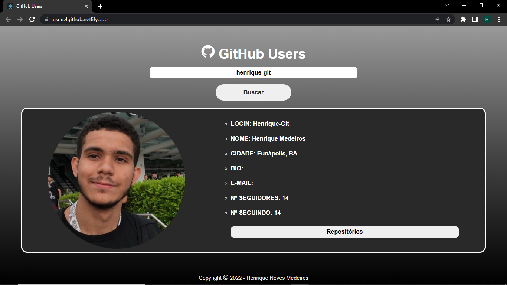
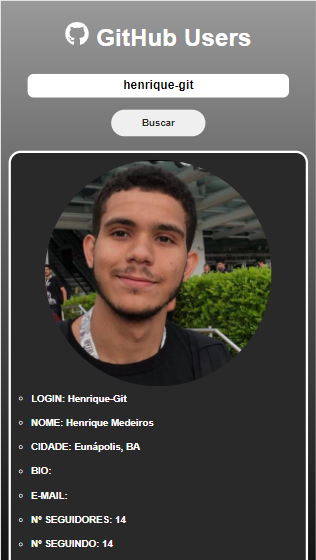
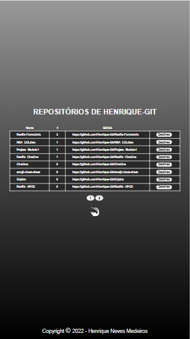
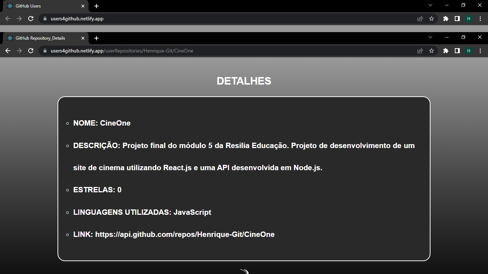
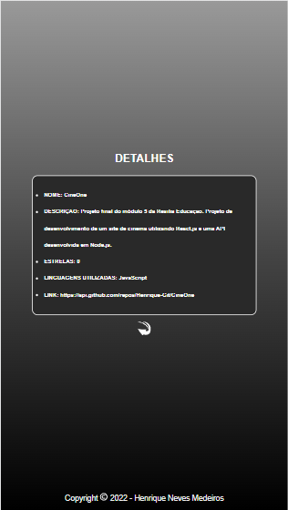

# GitHub Users 💻
Projeto que utiliza a API do GitHub para localizar usuários buscados, assim como as informações de sua conta e de seus repositórios.

## Link de Acesso 🔗

https://users4github.netlify.app

## Clonagem

Caso queira utilizar o projeto para estudos ou testes em máquina local, basta efetuar uma clonagem do repositório na máquina desejada utilizando o comando:
  
`git clone https://github.com/Henrique-Git/GitHub_Users`
  
Após abrir o projeto em um editor de código de sua preferência, basta executar o comando `npm install` para que todas as dependências utilizadas no projeto sejam instaladas e o site funcione corretamente.
 
Para conferir o funcionamento do programa, basta utilizar o comando `npm start`.

## Projeto 📄

O projeto consiste em realizar uma busca por um usuário registrado no GitHub e receber informações sobre a conta do usuário pesquisado.

É possível também a visualização de uma listagem dos repositórios desse usuário.

E após selecionar o repositório desejado é possível visualizar detalhes sobre o mesmo, ou até mesmo acessá-lo diretamente no repositório do GitHub.

## Tecnologias Utilizadas 🖥️

<ul>
  <li>HTML</li>
  <li>CSS</li>
  <li>Javascript</li>
  <li>React.js</li>
</ul>

## Autor 🤓

<li>Henrique Medeiros</li>
 

<a href="https://www.linkedin.com/in/henrique-neves-medeiros/" alt="LinkedIn" target="_blank">
    
<a>
